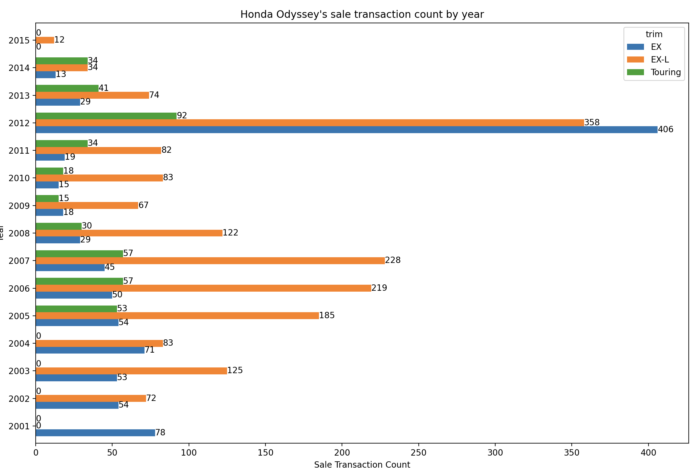

# Car Sale Transaction Analysis
Analyze car sale transaction data to come up with training data and test data for Regression model

This project is to analyze over 500,000 car sale transactions of 96 car makes, 972 models, and 1963 trims from 1982 
to 2015 to come up with what car make, model, trim, and year can be used for training data and test data for the
Regression model to predict car sale price

The analysis results in some popular car make, model, and trim having continuous car sale transaction from 2001 to 2015
(15 years). Two of these are the Toyota Camry (LE, SE, and XLE) and Honda Odyssey (EX, EX-L, and Touring), and the 
results are plotted with Matplotlib as below.

One approach was to look at a car make and summarize all sale transactions grouped by model, trim, and year then look 
for all sale transactions of each model and trim to find years with continuous sale transactions. The implementation of 
this approach can be done by sql query (data/toyota_model_trim_sales_by_year.sql), and example result as below table.

| MODEL | TRIM | Y2000 | Y2001 | Y2002 | Y2003 | Y2004 | Y2005 | Y2006 | Y2007 | Y2008 | Y2009 | Y2010 | Y2011 | Y2012 | Y2013 | Y2014 | Y2015 |
| --- | --- | --- | --- | --- | --- | --- | --- | --- | --- | --- | --- | --- | --- | --- | --- | --- | --- |
 | ... |
| Camry | LE | 80 | 25 | 179 | 168 | 120 | 154 | 89 | 377 | 143 | 358 | 211 | 532 | 1221 | 710 | 1296 | 11 |
| Camry | SE | 0 | 0 | 17 | 18 | 13 | 56 | 10 | 56 | 25 | 57 | 67 | 160 | 1218 | 752 | 1639 | 34 |
| Camry | XLE | 0 | 0 | 27 | 38 | 21 | 18 | 40 | 55 | 58 | 28 | 22 | 75 | 413 | 42 | 41 | 0 |
 | ... |

The result can then be used to visualize as in the previous 2 bar charts.

